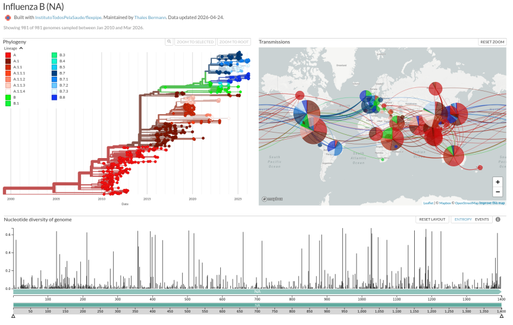

# flexpipe-InfluenzaB

Nextstrain pipeline for genomic epidemiology of Influenza B virus, segments HA and NA. This tool is derived from [flexpipe](https://github.com/InstitutoTodosPelaSaude/flexpipe) and adapted for Influenza B, similarly to how flexpipe-InfluenzaA was created for Influenza A.

This repository contains all essential files to generate Influenza B Nextstrain builds for the HA and NA segments. Using this pipeline, users can perform genomic epidemiology analyses, visualize phylogeographic results, and track Influenza B spread based on genomic data and associated metadata.



---

## Getting Started

To run this pipeline for Influenza B projects, see the instructions available in the original [flexpipe repository](https://github.com/InstitutoTodosPelaSaude/flexpipe), which covers Unix CLI navigation, installation of a Nextstrain environment with conda/mamba, and a step-by-step tutorial on generating a Nextstrain build (preparing, aligning, and visualizing genomic data).

---

## Dataset Retrieval and Quality Control

### Dataset Retrieval (NCBI Virus)

Sequences were retrieved from NCBI Virus using the following filters:

- Virus: Influenza B
- Segment: HA or NA
- Minimum coverage: ≥ 70% of the full segment length
- Collection date: ≥ 2010

### Quality Control (viralQC)

Sequences were processed using [viralQC](https://github.com/InstitutoTodosPelaSaude/viralQC), which performs quality filtering and runs Nextclade internally to assign clades:

```bash
vqc run \
  --input sequences.fasta \
  --output-dir qc_output \
  --output-file results.tsv \
  --datasets-dir viralqc_datasets \
  --blast-database viralqc_datasets/blast.fasta \
  --blast-database-metadata viralqc_datasets/blast.tsv \
  --cores 8 \
  -v
```

Sequences were retained only if they met:

- `genomeQuality` = A or B
- Coverage ≥ 70%

The viralQC output (containing `seqName` and `clade` columns) is used directly as input to the subsampling script. Sequences with missing or `unassigned` clades are excluded during subsampling.

---

## Influenza B Subsampling (NCBI Virus Metadata)

After QC, the dataset is subsampled using `subsample_FLU_B.py`:

```bash
python3 subsample_FLU_B.py \
  --metadata metadata.tsv \
  --nextclade viralqc_output.tsv \
  --output-prefix FLU_B_HA
```

### Available Arguments

| Argument | Default | Description |
|---|---|---|
| `--metadata` | *(required)* | Filtered post-QC metadata file |
| `--nextclade` | *(required)* | viralQC output CSV/TSV containing `seqName` and `clade` columns |
| `--output-prefix` | *(required)* | Prefix for output files |
| `--start-year` | `2010` | Minimum collection year |
| `--target-size` | `2000` | Target dataset size before final caps |
| `--keep-country` | `Brazil` | Focal country — all sequences retained |
| `--max-per-country-global` | `100` | Maximum sequences per country in the global dataset |
| `--max-per-year-global` | `100` | Maximum sequences per year in the final dataset |

### Filtering and Preprocessing

- Retains only complete dates (`YYYY-MM-DD`)
- Includes only sequences collected from **year 2010 onwards** (configurable via `--start-year`)
- Metadata is merged with viralQC results (including clade assignments), matched by accession
- Sequences with missing or `unassigned` clade are excluded
- Country names are normalized using a built-in alias table (e.g. `United States of America` → `USA`)
- A `region` column is inferred from country, grouping sequences into macro-regions (e.g. Latin America and the Caribbean, Eastern Asia, Sub-Saharan Africa)
- Priority scores are computed for each sequence based on date completeness and sequence length, used to guide quality-aware subsampling

### Subsampling Strategy

The dataset is reduced to approximately 2,000 sequences (configurable via `--target-size`) while preserving geographic, temporal, and evolutionary diversity.

**Brazil (focal country)**
- No subsampling applied — all sequences retained

**Global dataset**
- Sampling unit: **region + year** (macro-region × year stratum)
- Target per stratum: evenly distributed across all region+year combinations
- **Clade diversity within each stratum:**
  1. At least one sequence per full clade (rarest first)
  2. At least one sequence per `clade_major` (first hierarchical level) among remaining sequences
  3. Remaining slots filled by quality/recency priority (`date_precision_score` > `length_score` > `Collection_Date`)
- **Cap per country:** maximum of **100 sequences per country** (excluding focal country)
- **Cap per year:** maximum of **100 sequences per year** in the final dataset

### Outputs

The script generates two files:

| File | Description |
|---|---|
| `{prefix}_with_clades.tsv` | Full post-QC metadata merged with clade assignments, before subsampling |
| `{prefix}_subsampled.tsv` | Final filtered and subsampled metadata |

Example output files using `--output-prefix FLU_B_HA` or `FLU_B_NA`:

```
FLU_B_HA_with_clades.tsv
FLU_B_HA_subsampled.tsv

FLU_B_NA_with_clades.tsv
FLU_B_NA_subsampled.tsv
```

### Sequence Extraction

Extract the corresponding sequences using:

```bash
cut -f1 FLU_B_HA_subsampled.tsv | tail -n +2 > keep_ids.txt
seqkit grep -f keep_ids.txt sequences_HA.fasta -o subsampled_HA.fasta
```

---

## Adjustments for Influenza B Runs

The Snakefile provided here is pre-configured for Influenza B — HA and NA segments. Since these are individual gene segments (not full genomes), no UTR trimming is applied — masking is set to 1 bp on both ends as a minimal placeholder. The clock rate is left undefined so that Nextstrain (augur) estimates it automatically from the data.

```python
rule parameters:
    params:
        mask_5prime = 1,
        mask_3prime = 1,
        bootstrap = 1000,
        model = "MFP",
        root = "least-squares",
```

---

## Author

**Thales Bermann** — Instituto Todos pela Saúde (ITpS)
✉️ [thalesbermann@gmail.com](mailto:thalesbermann@gmail.com)

---

## License

This project is licensed under the [MIT License](LICENSE).
